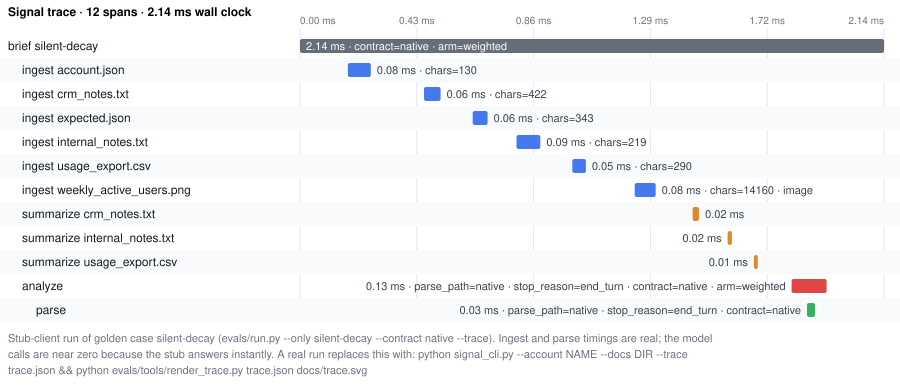

# Signal v0.3

[](https://github.com/SamieVargas/signal/actions/workflows/tests.yml)

**Paste the mess --> get the read.**  
AI-powered account intelligence for CS teams.

---

## What it does, and what it does not

Signal is a multi-call pipeline on the Anthropic API with per-role model routing, prompt-contracted JSON output behind a tolerant parser, source-weighted prompting with per-section attribution and a data-gaps list, multimodal document input, a Cloudflare Worker that enforces a model allowlist, a token clamp, and a field whitelist while keeping the key server-side, token dry-runs and a fingerprint cache to control cost, and an offline stub-client test suite that checks the routing, the caps, the parsing, and the chat loop with no API key. The prompt ranks all-hands and CRM sources over chat and picks the economic buyer over the most-mentioned name, and four focus modes swap in different instruction blocks and output budgets so a focused run costs less. Account prep went from about an hour to one minute, validated with early users including a senior CS leader. There is no retrieval step; documents go into the prompt after summarization. The offline tests check plumbing, and the scored eval set with its ablation is further down.

## Architecture

```
Browser (index.html on GitHub Pages)
    ↓ POST request (account data + prompt)
Cloudflare Worker (worker.js)
    ↓ forwards with API key in header
Anthropic API
    ↓ returns analysis JSON
Cloudflare Worker
    ↓ strips headers, adds CORS
Browser renders brief + chat
```

The API key never touches the browser. 

**Tracing.** `--trace trace.json` on the CLI and on `evals/run.py` writes
one OpenTelemetry span per line: a root `signal.brief` per brief, a
`signal.ingest` per document (label, kind, chars), a `signal.summarize` per
summary call (model, tokens, latency), `signal.analyze` for the analysis
call (model, contract, arm, parse path, stop reason, tokens) and
`signal.parse` for parsing and validation. The packages are an optional
extra (`pip install -r requirements-trace.txt`); without them the spans are
a no-op shim and nothing changes. `evals/tools/render_trace.py` turns the
file into an SVG waterfall.



The figure is a stub-client run of the golden case `silent-decay`, so the
ingest and parse timings are real and the model calls are near zero because
the stub answers instantly. A real run replaces it with
`python signal_cli.py --account NAME --docs DIR --trace trace.json && python evals/tools/render_trace.py trace.json docs/trace.svg`.

---

## New in v0.3

- Source weighting (all-hands/CRM as primary, chat as secondary) + a contact read that targets the economic buyer, not chat-log noise
- Per-section source attribution and a Data Gaps callout
- Per-document removal, plus an analysis focus toggle (Full / Revenue Risk / Relationship / Pre-Call) that trims tokens on focused modes
- Collapsible + copy-to-clipboard brief sections, skeleton loader, Export to PDF, Cmd/Ctrl+Enter to re-analyze, mobile layout, and assorted polish

## What's in v0.0.1

- Portfolio view — 4 demo accounts + add your own
- File upload — PDF, DOCX, XLSX/XLS, plus .txt, .csv, .vtt, .srt, .md, .json, .html, .log, .tsv (parsed in-browser; scanned/image-only PDFs are flagged with a clear message since they have no text layer to read)
- Paste input — raw text, Teams chat, MBR notes, etc.
- Auto content-type detection (transcript, MBR/QBR, CSV, chat log, email, SWOT)
- AI synthesis — situation read, contact persona, ranked leverage points, "do this today"
- Chat interface — interrogate Signal about this specific account
- Privacy — nothing stored, session only, cleared on close

---

## What's next (v0.1+)

- [ ] Longitudinal memory — compare this call to the last one
- [ ] Feedback loop — "here's what happened after you suggested that"
- [ ] Multi-contact persona — different reads for champion vs economic buyer
- [ ] Revenue trend visualization from CSV input
- [ ] Export brief as PDF / shareable link

---

# Signal — Python CLI

> "I spent eight years doing this hour of account digging manually every month
> across a $14M enterprise book. This is the Python version of what I wished existed."

A command-line rebuild of the analysis engine using the Anthropic Python SDK
directly — no browser, no Worker proxy. Built to keep token usage under control
on real, messy account data.

## Highlights

- **Two-call LLM architecture** with explicit token management: summarize each
  doc individually (cheap), then analyze the small summaries — not the raw docs.
  On large inputs this cuts the main analysis call by **~96%** (measured via
  `--dry-run`: 22,976 → ≤1,012 input tokens for two long transcripts).
- **Smart document truncation** — front/back extraction (45% front, 35% back),
  preserving intros/stated concerns + action items and dropping middle filler.
- **Content-type auto-detection** across 15+ formats (transcripts, MBR/QBR/EBR,
  Teams/Slack, CSV, email, SWOT), ported from the JS `detectType()` logic.
- **Structured JSON output** with the 11-type risk taxonomy and 5-field contact
  persona carried over from the web app; tolerant JSON parsing.
- **`rich` terminal output**, JSON saved to `./output/`, interactive chat loop.

## Setup

```bash
python -m venv .venv && source .venv/bin/activate
pip install -r requirements.txt
export ANTHROPIC_API_KEY=sk-ant-...      # or put it in a .env file
```

## Usage

```bash
# Analyze a directory of account docs
python signal_cli.py --account "Koala" --contact "Sarah Chen, VP of Product" \
  --arr 180000 --renewal 67 --docs ./tests/mock_docs/

# Paste a single doc from stdin
python signal_cli.py --account "Koala" --paste

# Inspect token counts before spending credits — no API calls
python signal_cli.py --account "Koala" --docs ./tests/mock_docs/ --dry-run

# Skip the interactive chat loop
python signal_cli.py --account "Koala" --docs ./tests/mock_docs/ --no-chat
```

> The entry point is `signal_cli.py`, **not** `signal.py`: a module named
> `signal.py` on the path shadows the standard-library `signal` module that
> `anthropic`/`anyio` import at startup, which would crash the pipeline.

## Project layout

```
signal_cli.py     # CLI entry — argparse, orchestration, rich output, --dry-run, --contract
ingest.py         # file reading, type detection, smart truncation, PNG/PDF -> content blocks
summarize.py      # Call 1: per-doc summarization
analyze.py        # Call 2: synthesis -> structured JSON brief, prompt or native contract
schema.py         # the brief as a JSON Schema, built from the prompt's constants
dryrun.py         # token estimates shared by the CLI and the eval runner
chat.py           # interactive follow-up loop
prompts.py        # all prompt templates + the contract constants
config.py         # model, token limits, client setup
tests/            # mock_docs/ + offline pipeline test (no API key needed)
evals/            # golden set, runner, results (see Evals below)
```

## Tests

```bash
python tests/test_pipeline.py     # offline, uses a stub client: pipeline, both contracts, parse paths
python evals/test_run.py          # offline: scoring functions and one stubbed golden case
```

## Evals

The stub-client test checks plumbing. This measures output quality.

**Golden set.** `evals/golden/` holds thirteen synthetic accounts, each with
its documents in the formats the app accepts (three include a PNG chart or a
PDF deck) and a hand-written `expected.json`: the risk types from the
taxonomy, the economic buyer's name, the source labels the brief must cite,
and whether data gaps are expected. The labels were written before any
pipeline run on these files, so they are not anchored on the model's output.
The set was built to include the cases that separate a good read from a
plausible one: the most-mentioned contact is not the buyer, chat is positive
while the CRM notes are not, no real risk at all, and a transcript long
enough to truncate with the signal at the end.

**Runner.** `evals/run.py` reuses the CLI's ingest, summarize, and analyze
functions, so a score is a score for the real pipeline.

```bash
python evals/run.py --dry-run                      # token estimate per case, no API calls
python evals/run.py                                # full mode, prompt contract, weighted prompt
python evals/run.py --contract native              # same set, native structured outputs
python evals/run.py --arm unweighted --runs 20     # one arm of the ablation
python evals/run.py --mode revenue                 # any focus mode
```

Per case it scores risk-type recall (the primary metric) and precision,
economic-buyer accuracy (the labeled name inside the brief's primary
contact, whitespace and case normalized), attribution coverage (every
required source label appears somewhere in `section_sources`), data gaps
present when expected, the parse path (`native`, `recovered_by_parser`, or
`failed`), and tokens and latency for the analysis call. Results go to
`evals/results/<date>-<mode>-<contract>-<arm>.md`, with `-x<runs>` on the end
when there is more than one run per case, and the raw briefs beside them as
JSON. A failed parse, or an empty brief on a case with expected
risks, is a hard fail and exits 1.

**Two contracts.** `--contract prompt` is the original: the JSON shape is
described in the prompt and a tolerant parser strips fences and prose.
`--contract native` sends the same shape as a JSON Schema through the API's
structured outputs (`output_config.format`, no beta header), with the schema
built from the same constants as the prompt so they cannot drift. The parser
stays as the fallback under both contracts because a constrained response
still has ways to disappoint: the model can hit `max_tokens` mid-object, a
proxy between the app and the API can drop the parameter, and an older
model in the allowlist may not honour it. Recording which path handled each
reply is how the two contracts are compared, and how a silent regression
would show up.

**Ablation.** `--arm unweighted` removes the source-weighting block from the
analysis prompt (no ranking of decks and CRM notes over chat, no
economic-buyer-over-most-mentioned rule) and changes nothing else. Twenty
runs per arm on the same set. The case built to separate the arms is
`most-mentioned-not-buyer`; if it does not, that is the finding.

**Batch API.** `--batch` sends the analysis calls, the ones the cost column
counts, through the Message Batches API instead of one live call at a time:
one request per case-run with `custom_id` `<case>-<run>-<arm>-<contract>`,
built by the same function as the live request so it carries the same
parameters (`output_config` included under the native contract), polled
until the batch ends, then every result goes through the same parse and
scoring path as a live reply, so the numbers stay comparable and the parse
column still counts. A result that errored or expired is recorded as a
failed parse with the cause. The per-document summaries stay live. Costs
in the table use the 0.5 batch multiplier and the results file gets
`-batch` on its name, so a twenty-run ablation arm runs at half the
analysis-call price with no change to what is scored. Nothing here has been
run through it yet; the three results above were live calls.

**Results.** All three runs are in `evals/results/`, with the models in
`config.py`: the single prompt-contract pass and arm A on 2026-09-21, arm B
on 2026-09-22 after a first attempt stopped at eleven passes when the API
credit ran out (the runner now writes a partial file when that happens; it
did not then). The single native pass and the twenty-run arm A share a
configuration, so one row covers both.

| Date | Run | Risk recall | Risk precision | Buyer accuracy | Attribution | Parse native / recovered / failed | Cost per run / whole run |
| --- | --- | --- | --- | --- | --- | --- | --- |
| 2026-09-21 | prompt contract, weighted, 1 run | 96% | 100% | 92% | 92% | 5 / 8 / 0 | $0.0323 / $0.4205 |
| 2026-09-21 | native contract, weighted, 20 runs (ablation arm A) | 90% | 94% | 93% | 92% | 260 / 0 / 0 | $0.0308 / $7.9974 |
| 2026-09-22 | native contract, unweighted, 20 runs (ablation arm B) | 90% | 93% | 69% | 95% | 260 / 0 / 0 | $0.0292 / $7.6039 |

Cost is the analysis call only (the per-document summary calls do not record
tokens), priced from the tokens in each results JSON at the list prices in
`config.PRICES` (read 2026-09-23; re-check them against the pricing page
before quoting). "Per run" is one case, one pass, averaged; "whole run" is
every case-run summed. `evals/tools/recost.py` recomputes both from the JSON
files without re-running anything.

What the 520 native runs say, case by case:

- The weighting block is worth 24 points of buyer accuracy, and all of it is
  the three cases built around the most-mentioned name. With the block,
  `most-mentioned-not-buyer`, `adoption-failure` and `relationship-gap` name
  the economic buyer in 20 of 20 runs each; without it, 0 of 20 each. Every
  other case names the buyer 20 of 20 in both arms, apart from
  `champion-loss` below. That is the effect the block exists to produce, and
  the ablation is the evidence it does.
- Risk recall is 90% in both arms, but the misses move. Without the block,
  `most-mentioned-not-buyer` is read right in 15 of 20 runs instead of 18,
  `relationship-gap` in 17 instead of 20, and `chat-positive-crm-negative`
  in 17 instead of 19. `vibe-risk` goes the other way, right in 14 of 20
  without the block against 7 with it, otherwise read as sentiment mismatch
  or silent decay; the fixture describes a mood rather than an event, the
  taxonomy has two neighbors for that, and the ranking of sources seems to
  pull the reading toward the CRM's neighbor. That is the one number the
  block makes worse.
- `truncated-transcript` expects two risks and the brief names one of them
  every time in both arms, so it scores 50% on every run and holds recall
  below 100% on its own.
- `champion-loss` misses the economic buyer in 19 of 20 runs with the block
  and 20 of 20 without, and `silent-decay` cites the CSV in 1 of 20 with the
  block and 7 of 20 without, which is where arm B's higher attribution
  coverage comes from. Both are the same kind of miss: a source that was in
  the packet and was not credited, and the block does not fix either.
- The prompt contract recovered 8 of 13 replies through the parser; the
  native contract needed it on none of 520. That is the row the parser
  section above is about.
- Arm B is also cheaper, 2,815 tokens in against 3,004, since the block is
  about 190 tokens of prompt, and about a second and a half faster per call.
