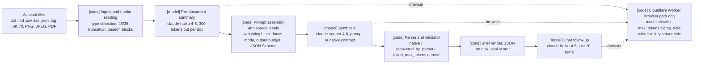

# Signal

[](https://github.com/SamieVargas/signal/actions/workflows/tests.yml)

Signal reads a messy customer-account file (decks, MBR/QBR notes, CRM
exports, chat logs, transcripts, email threads, a usage chart or a PDF deck)
and writes a revenue-risk, relationship-health, or pre-call brief for a
customer-success team. It is a browser app (`index.html`, served from GitHub
Pages behind a Cloudflare Worker that holds the API key) and a Python CLI
(`signal_cli.py`) on the same prompts. Paste the mess, get the read.

## Problem

> "I spent eight years doing this hour of account digging manually every
> month across a $14M enterprise book. This is the Python version of what I
> wished existed."

Before Signal, preparing for an account call meant reading everything the
account had produced since the last one, by hand, and working out from a
stack of decks, notes, exports and chat logs what was actually happening,
who the economic buyer was, where to press, and what to do today. The
browser app did that first; the CLI is a rebuild of the analysis engine on
the Anthropic Python SDK directly, with no browser and no Worker proxy,
built to keep token usage under control on real, messy account data.
Account prep went from about an hour to one minute, validated with early
users including a senior CS leader.

## Architecture



`[code]` boxes are deterministic and tested without a model; `[model]`
boxes are API calls. There is no retrieval step; documents go into the
prompt after summarization.

**Ingest and media reading [code].** `ingest.read_docs` reads every
text-like file in a directory, `detect_type` labels it (filename keywords,
then extension, then content sniffing, across 15+ formats: transcripts,
MBR/QBR/EBR/ABR notes, Teams/Slack, CSV, email, SWOT, kick-off decks, CRM
notes, support tickets; ported from the JS `detectType()`), and
`smart_truncate` keeps the first 45% and last 35% of anything over
`MAX_DOC_TOKENS` (1,500), which is where intros, stated concerns and action
items live. `read_media` turns PNG, JPEG and PDF files into the image and
document content blocks the analysis call attaches beside the summaries,
the same way the browser app does. In the browser, PDF, DOCX and XLSX/XLS
plus `.txt .csv .vtt .srt .md .json .html .log .tsv` are parsed in the
page; scanned or image-only PDFs are flagged with a clear message since
they have no text layer; documents can be removed one at a time.

**Per-document summaries [model].** Call 1 sends each truncated document
to `claude-haiku-4-5` with a 300-token output cap. Analyzing the small
summaries instead of the raw documents cuts the main analysis call by
about 96% on large inputs, measured with `--dry-run`: 22,976 down to at
most 1,012 input tokens for two long transcripts. The gap grows with
document size.

**Prompt assembly and source labels [code].** `analyze.build_analysis_prompt`
renders the summaries with their type labels in brackets, the account
fields, the source-weighting block (all-hands decks, kick-off decks,
MBR/QBR notes and CRM notes ranked as primary sources over chat logs,
transcripts and internal notes; the economic buyer picked over the
most-mentioned name), the focus instruction, and the output shape. Four
focus modes (Full, Revenue Risk, Relationship, Pre-Call) swap in different
instruction blocks and output budgets (`FOCUS_MAX_TOKENS`: 4000, 2200,
2600, 2000), so a focused run costs less. `schema.py` builds the JSON
Schema for the native contract from the same constants as the prompt (the
eleven-type risk taxonomy plus Healthy and Unknown, the five persona
fields, the four sections), so the two cannot drift.

**Synthesis [model].** Call 2 sends the prompt, and any media blocks, to
`claude-sonnet-4-6`. Under `--contract prompt` the JSON shape is described
in the prompt and the model is asked to return only JSON; under
`--contract native` the same shape goes as a JSON Schema through the API's
structured outputs (`output_config.format`, no beta header). The brief
carries a situation read, one risk type with severity and confidence, a
five-field contact persona and secondary contacts, ranked leverage points,
"do this today", per-section source attribution, a data-gaps list and
suggested questions.

**Parser and validator [code].** `analyze.parse_brief` tries the reply as
JSON, then strips fences and surrounding prose, and records which path
handled it: `native`, `recovered_by_parser`, or `failed`. The parser stays
as the fallback under both contracts because a constrained response still
has ways to disappoint: the model can hit `max_tokens` mid-object, a proxy
between the app and the API can drop the parameter, and an older model in
the allowlist may not honour it. A reply that stopped at `max_tokens` is
named as that rather than as a parse error, because raising the budget is
the fix. The eval scorer (`evals/run.py`) matches risk types by exact
string against the taxonomy and the buyer by normalized name.

**Cloudflare Worker [code], browser path only.** `worker.js` keeps the API
key server-side and enforces a model allowlist (`claude-sonnet-4-6`,
`claude-opus-4-8`, `claude-haiku-4-5`), clamps `max_tokens` to 4,096,
and builds the outbound payload from a strict whitelist (`model`,
`max_tokens`, `messages`, a string `system`, and only a `json_schema`
`output_config.format`), dropping everything else. It strips headers and
adds CORS on the way back. The browser also keeps a session-only
fingerprint cache keyed by account and document contents, so re-analyzing
the same inputs skips the API.

**Chat follow-up [model].** After the brief, a chat loop on
`claude-haiku-4-5` answers questions about the account with the brief and
the summaries as its system prompt, keeping the last ten turns.

Rules enforced in code: the model allowlist, the token clamp and the field
whitelist in the Worker; document truncation, the summary output cap and
the per-mode output budgets; the JSON Schema under the native contract; the
parser and its path accounting; the control files (`expected.json`,
`account.json`) kept out of the summaries in the eval runner. Rules only
asked of the model: source weighting, the economic-buyer rule, per-section
attribution, the data-gaps list, the focus instruction, and "return only
JSON" under the prompt contract. The evals below measure how well the asked
rules hold.

**Tracing.** `--trace trace.json` on the CLI and on `evals/run.py` writes
one OpenTelemetry span per line: a root `signal.brief` per brief, a
`signal.ingest` per document (label, kind, chars), a `signal.summarize` per
summary call (model, tokens, latency), `signal.analyze` for the analysis
call (model, contract, arm, parse path, stop reason, tokens) and
`signal.parse` for parsing and validation. The packages are an optional
extra (`pip install -r requirements-trace.txt`); without them the spans are
a no-op shim and nothing changes. `evals/tools/render_trace.py` turns the
file into an SVG waterfall.


The figure is a stub-client run of the golden case `silent-decay`, so the
ingest and parse timings are real and the model calls are near zero because
the stub answers instantly. A real run replaces it with
`python signal_cli.py --account NAME --docs DIR --trace trace.json && python evals/tools/render_trace.py trace.json docs/trace.svg`.

## How to run

```bash
python -m venv .venv && source .venv/bin/activate
pip install -r requirements.txt
pip install -r requirements-trace.txt       # optional, only for --trace
export ANTHROPIC_API_KEY=sk-ant-...         # or put it in a .env file
```

```bash
# Analyze a directory of account docs
python signal_cli.py --account "Koala" --contact "Sarah Chen, VP of Product" \
  --arr 180000 --renewal 67 --docs ./tests/mock_docs/

# Paste a single doc from stdin
python signal_cli.py --account "Koala" --paste

# Inspect token counts before spending credits, no API calls
python signal_cli.py --account "Koala" --docs ./tests/mock_docs/ --dry-run

# Skip the interactive chat loop; pick a contract or a focus mode; write a trace
python signal_cli.py --account "Koala" --docs ./tests/mock_docs/ --no-chat
python signal_cli.py --account "Koala" --docs ./tests/mock_docs/ --contract native --mode precall
python signal_cli.py --account "Koala" --docs ./tests/mock_docs/ --trace trace.json
```

The no-credit path is `--dry-run` on the CLI and on the eval runner: it
prints the per-document and per-call token estimates and makes no API
call. The CLI checks for credentials before the first call and exits with
a message rather than a traceback mid-pipeline. Output goes to the
terminal through `rich` and to `./output/signal_output_<account>_<date>.json`.

The browser app: paste `worker.js` into the Cloudflare Workers editor,
deploy, add `ANTHROPIC_API_KEY` as an encrypted variable, and open
`index.html` (it ships with a portfolio view of four demo accounts plus
your own, paste input, file upload, the focus toggle, collapsible and
copy-to-clipboard brief sections, a skeleton loader, Export to PDF,
Cmd/Ctrl+Enter to re-analyze, a mobile layout, and a chat interface;
nothing is stored, session only, cleared on close).

> The CLI entry point is `signal_cli.py`, **not** `signal.py`: a module
> named `signal.py` on the path shadows the standard-library `signal`
> module that `anthropic`/`anyio` import at startup, which would crash the
> pipeline with `ImportError: cannot import name 'Signals'`.

## Evals

The stub-client test checks plumbing. This measures output quality.

**Golden set (labels written 2026-09-21).** `evals/golden/` holds thirteen
synthetic accounts, each with its documents in the formats the app accepts
(three include a PNG chart or a PDF deck) and a hand-written
`expected.json`: the risk types from the taxonomy, the economic buyer's
name, the source labels the brief must cite, and whether data gaps are
expected. The labels were written before any pipeline run on these files,
so they are not anchored on the model's output. The set was built to
include the cases that separate a good read from a plausible one: the
most-mentioned contact is not the buyer, chat is positive while the CRM
notes are not, no real risk at all, and a transcript long enough to
truncate with the signal at the end.

**Runner.** `evals/run.py` reuses the CLI's ingest, summarize, and analyze
functions, so a score is a score for the real pipeline.

**Metrics.** Per case it scores risk-type recall (the primary metric: the
share of expected risk types the brief's single `risk_type` hits) and
precision (1 when the predicted type is expected; for a no-risk case, 1
only if the model said Healthy or Unknown), economic-buyer accuracy (the
labeled name inside the brief's primary contact, whitespace and case
normalized), attribution coverage (every required source label appears
somewhere in `section_sources`), data gaps present when expected, the parse
path (`native`, `recovered_by_parser`, or `failed`), and tokens, latency
and cost for the analysis call. Results go to
`evals/results/<date>-<mode>-<contract>-<arm>.md`, with `-x<runs>` on the
end when there is more than one run per case and `-batch` when the
analysis calls went through the Batch API, and the raw briefs beside them
as JSON. A failed parse, or an empty brief on a case with expected risks,
is a hard fail and exits 1.

**Results.** All three runs are in `evals/results/`, with the models in
`config.py`: the single prompt-contract pass and arm A on 2026-09-21, arm B
on 2026-09-22 after a first attempt stopped at eleven passes when the API
credit ran out (the runner now writes a partial file when that happens; it
did not then). The single native pass and the twenty-run arm A share a
configuration, so one row covers both.

| Date | Run | Risk recall | Risk precision | Buyer accuracy | Attribution | Parse native / recovered / failed | Cost per run / whole run |
| --- | --- | --- | --- | --- | --- | --- | --- |
| 2026-09-21 | prompt contract, weighted, 1 run | 96% | 100% | 92% | 92% | 5 / 8 / 0 | $0.0323 / $0.4205 |
| 2026-09-21 | native contract, weighted, 20 runs (ablation arm A) | 90% | 94% | 93% | 92% | 260 / 0 / 0 | $0.0308 / $7.9974 |
| 2026-09-22 | native contract, unweighted, 20 runs (ablation arm B) | 90% | 93% | 69% | 95% | 260 / 0 / 0 | $0.0292 / $7.6039 |

Cost is the analysis call only (the per-document summary calls do not
record tokens), priced from the tokens in each results JSON at the list
prices in `config.PRICES` (read 2026-09-23; re-check them against the
pricing page before quoting). "Per run" is one case, one pass, averaged;
"whole run" is every case-run summed. `evals/tools/recost.py` recomputes
both from the JSON files without re-running anything.

**Two contracts.** `--contract prompt` is the original: the JSON shape is
described in the prompt and a tolerant parser strips fences and prose.
`--contract native` sends the same shape as a JSON Schema through the API's
structured outputs, with the schema built from the same constants as the
prompt so they cannot drift. Recording which path handled each reply is
how the two contracts are compared, and how a silent regression would show
up: the prompt contract recovered 8 of 13 replies through the parser; the
native contract needed it on none of 520.

**Ablation.** `--arm unweighted` removes the source-weighting block from the
analysis prompt (no ranking of decks and CRM notes over chat, no
economic-buyer-over-most-mentioned rule) and changes nothing else. Twenty
runs per arm on the same set. The case built to separate the arms is
`most-mentioned-not-buyer`; if it does not, that is the finding. What the
520 native runs say: the weighting block is worth 24 points of buyer
accuracy, and all of it is the three cases built around the most-mentioned
name. With the block, `most-mentioned-not-buyer`, `adoption-failure` and
`relationship-gap` name the economic buyer in 20 of 20 runs each; without
it, 0 of 20 each. Every other case names the buyer 20 of 20 in both arms,
apart from `champion-loss` in the table below. That is the effect the
block exists to produce, and the ablation is the evidence it does. Risk
recall is 90% in both arms, but the misses move (the rows below). Arm B is
also cheaper, 2,815 tokens in against 3,004, since the block is about 190
tokens of prompt, and about a second and a half faster per call.

**Batch API.** `--batch` sends the analysis calls, the ones the cost column
counts, through the Message Batches API instead of one live call at a time:
one request per case-run with `custom_id` `<case>-<run>-<arm>-<contract>`,
built by the same function as the live request so it carries the same
parameters (`output_config` included under the native contract), polled
until the batch ends, then every result goes through the same parse and
scoring path as a live reply, so the numbers stay comparable and the parse
column still counts. A result that errored or expired is recorded as a
failed parse with the cause. The per-document summaries stay live. Costs
in the table use the 0.5 batch multiplier and the results file gets
`-batch` on its name, so a twenty-run ablation arm runs at half the
analysis-call price with no change to what is scored. Nothing here has been
run through it yet; the three results above were live calls.

**Reproduce.**

```bash
python evals/run.py --dry-run                      # token estimate per case, no API calls
python evals/run.py                                # full mode, prompt contract, weighted
python evals/run.py --contract native --runs 20    # ablation arm A
python evals/run.py --contract native --arm unweighted --runs 20   # ablation arm B
python evals/run.py --contract native --runs 20 --batch            # either arm, half price
python evals/run.py --mode revenue                 # any focus mode
python evals/tools/recost.py                       # rewrite the cost column of every results table
```

## Failure modes

Every row traces to a results file in `evals/results/`, a test, or a code
path. Counts are from the 2026-09-21 prompt-contract pass (13 case-runs)
and the two twenty-run native arms (260 case-runs each).

| What breaks | How often (from the results) | What catches it | What it costs when it slips |
| --- | --- | --- | --- |
| `vibe-risk` is read as Sentiment mismatch or Silent decay: the fixture describes a mood rather than an event, the taxonomy has two neighbors for that, and the ranking of sources pulls the reading toward the CRM's neighbor | Read right 7 of 20 runs with the weighting block, 14 of 20 without; the one number the block makes worse | Risk recall in the eval; nothing at run time | The brief files the account under a neighboring risk type; the leverage points still follow the data, the label is wrong |
| `champion-loss` names the wrong economic buyer: a source that was in the packet and was not credited | 19 of 20 runs with the block, 20 of 20 without, and the one prompt-contract run; the block does not fix it | Buyer accuracy in the eval; nothing at run time | The contact read and the approach recommendation are written for the wrong person |
| Without the weighting block, `most-mentioned-not-buyer`, `adoption-failure` and `relationship-gap` name the most-mentioned contact as the buyer | 0 of 20 each in arm B against 20 of 20 each in arm A | The block is in the shipped prompt; the ablation measures it | 24 points of buyer accuracy (93% to 69%) |
| Without the block, risk recall moves on three cases | `most-mentioned-not-buyer` right in 15 of 20 runs instead of 18, `relationship-gap` 17 instead of 20, `chat-positive-crm-negative` 17 instead of 19 | Same as above | The same 90% aggregate recall hides misses on the cases the set was built around |
| `truncated-transcript` expects two risks and the brief names one; `risk_type` is a single field, and the case's transcript is long enough for `smart_truncate` to drop its middle | 50% on every run in both arms and in the prompt-contract pass; holds recall below 100% on its own | Risk recall; `smart_truncate` keeps 45% front and 35% back on purpose | The second risk is never written down |
| `silent-decay` does not cite its CSV in `section_sources` | Cited in 1 of 20 runs with the block, 7 of 20 without, and 0 of 1 in the prompt-contract pass (where arm B's higher attribution coverage comes from) | Attribution coverage in the eval | A source that shaped the read goes uncredited, so the reader cannot check it |
| The reply stops at `max_tokens` mid-object | 0 of 533 recorded case-runs at the 4,000-token full-mode budget; at 1,500 it truncated the full brief on every account, which is why the budgets in `prompts.FOCUS_MAX_TOKENS` are what they are | `analyze.finish_analysis` names `stop_reason == max_tokens` as the cause instead of a parse error; the browser checks `stop_reason`; the Worker clamps to 4,096; covered by `tests/test_pipeline.py` | The case-run is a hard fail and the analysis call's tokens are spent (about $0.03 at list) |
| Under the prompt contract the reply comes back fenced or wrapped in prose | 8 of 13 replies on 2026-09-21; 0 of 520 under the native contract | The tolerant parser (`recovered_by_parser`), with the path recorded per reply | Nothing when recovered; a reply neither path can parse is a hard fail, exit 1, with the first 300 characters printed |
| The API credit runs out, or Ctrl+C, mid-run | Once: the first arm-B attempt stopped at eleven of twenty passes on 2026-09-22, and every finished case was lost | The runner now writes a `-partial` table and JSON and exits 130; covered by `evals/test_run.py` | Before the fix, the whole run; now, the unfinished passes only |
| A Batch API result comes back errored, expired or canceled | None recorded yet; the batch path has not been run against the API | Recorded as a failed parse for that case-run with the cause in `error`; hard fail; covered by `evals/test_run.py` with a fake batches client | That case-run has no brief |
| A scanned or image-only PDF is uploaded in the browser | Not counted | Flagged with a clear message, since there is no text layer to read | The file contributes nothing to the brief |
| The entry point is named `signal.py` | Every run, at import | The entry point is `signal_cli.py` and the README says why | `ImportError: cannot import name 'Signals'` before the first call |

## Not built

- No retrieval step; documents go into the prompt after summarization, and
  anything past the truncation window is not read.
- Longitudinal memory: compare this call to the last one.
- Feedback loop: "here's what happened after you suggested that".
- Multi-contact persona: different reads for champion vs economic buyer
  (the brief lists secondary contacts, but reads only the primary).
- Revenue trend visualization from CSV input.
- A shareable link for a brief (Export to PDF landed in v0.3).
- The summary calls do not record tokens, so the cost column covers the
  analysis call only.
- The Batch API path has not been run against the API; the three results
  tables were live calls.
- Only `full` mode has been scored; the other three focus modes have no
  results file.
- `--dry-run` does not estimate the PNG/PDF blocks attached to the
  analysis call.
- Traces go to a local JSON file; there is no OTLP export to a collector.
- The Worker answers any origin (`ALLOWED_ORIGIN = '*'`); it relies on the
  allowlist, the clamp and the whitelist rather than on origin checks.

## Layout

```
signal_cli.py           # CLI entry: argparse, orchestration, rich output, --dry-run, --contract, --mode, --trace
ingest.py               # file reading, type detection, smart truncation, PNG/JPEG/PDF -> content blocks
summarize.py            # Call 1: per-doc summarization
analyze.py              # Call 2: request builder, synthesis call, parser, both contracts, parse-path accounting
schema.py               # the brief as a JSON Schema, built from the prompt's constants
prompts.py              # all prompt templates, the contract constants, focus modes and output budgets
config.py               # models per role, token limits, the price table and cost_usd(), client setup
dryrun.py               # token estimates shared by the CLI and the eval runner
chat.py                 # interactive follow-up loop
tracing.py              # optional OpenTelemetry spans, no-op shim without the packages, JSON-lines exporter
index.html              # the browser app (GitHub Pages)
worker.js               # Cloudflare Worker proxy: allowlist, token clamp, field whitelist, key server-side
assets/                 # documents for the demo accounts
requirements.txt        # anthropic, rich, python-dotenv
requirements-trace.txt  # opentelemetry-api, opentelemetry-sdk (optional)
docs/trace-stub.svg     # the stub-client trace shown above
tests/test_pipeline.py  # offline: pipeline, both contracts, parse paths, token cap, media, chat, cost, tracing
tests/mock_docs/        # three Koala documents for the tests and the usage examples
evals/run.py            # the golden-set runner: scoring, live and --batch, --trace, results tables
evals/test_run.py       # offline: scoring functions, one stubbed case, batch mode, recost, render_trace
evals/golden/           # thirteen synthetic accounts with expected.json labels (README inside)
evals/results/          # dated results tables and raw briefs
evals/tools/recost.py   # rewrite the cost rows and column of existing results tables from their JSON
evals/tools/render_trace.py   # a --trace file -> SVG waterfall
evals/tools/make_media.py     # regenerate the golden set's PNG chart and PDF deck
.github/workflows/tests.yml   # CI: the two offline test files on Python 3.11, no API key
```

Tests run offline against a stub client, with or without the tracing
packages installed:

```bash
python -m pytest -q tests/ evals/test_run.py    # what CI runs
python tests/test_pipeline.py                   # or as plain scripts
python evals/test_run.py
```
